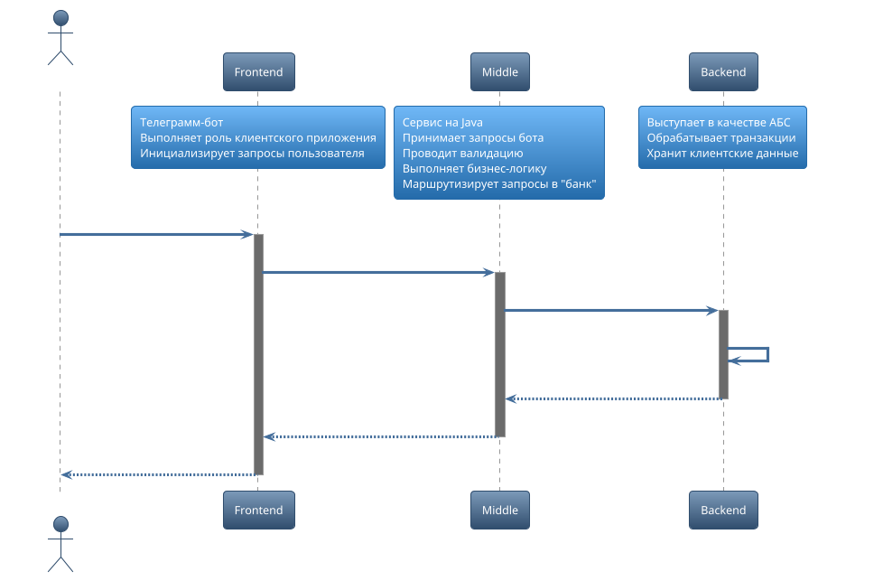

<h1 align="center">"Мини-банк" Middle-сервис</h1>

 Создано в рамках обучения в академии Backend-разработки <a href="https://gpb.fut.ru/itfactory/backend"> GPB IT Factory</a>

<h1 id="contents">Оглавление</h1>

1. [О проекте](#1)
2. [Начало работы](#2)
3. [Необходимые компоненты](#3)
4. [Скачивание и установка](#4)
5. [Используемые команды и примеры](#5)
6. [Контакты](#6)
7. [To Do](#7)

<h2 id="1">О проекте</h2>

Данный проект представляет собой часть банковского приложения\
Middle-сервис, часть "мини-банка", принимающая запросы от [telegram-бота](https://github.com/gpb-it-factory/elenberger-telergam-bot). Также проводит валидацию, выполняет бизнес логику, маршрутизирует запросы в "банк"\
Полная схема "мини-банка":

[Вверх :arrow_up:](#contents)

<h2 id="2">Начало работы</h2>

:warning: Раздел в разработке

[Вверх :arrow_up:](#contents)

<h2 id="3">Используемые компоненты</h2>

:warning: Новые компоненты будут добавляться по мере развития проекта

- [Java 17+](https://www.java.com/ru/)
- [Gradle 8.7](https://www.gradle.org/)
- [Spring Boot](https://www.spring.io/projects/spring-boot)
- [WireMock](https://wiremock.org/)
- [Lombok](https://projectlombok.org/)
- [JUnit5](https://junit.org/junit5/)
- [Mockito](https://site.mockito.org/)

Для работы приложения необходимо иметь установленные Java17+ и Gradle 8.7

[Вверх :arrow_up:](#contents)

<h2 id="4">Скачивание и установка</h2>

:warning: Раздел в разработке\
Для скачивания репозитория используйте в PowerShell команду:  git clone https://github.com/gpb-it-factory/elenberger-middle-service \
Для запуска приложения в PowerShell перейдите в каталог со склонированным репозиторием и используйте команду: **./gradlew bootRun**

[Вверх :arrow_up:](#contents)

<h2 id="5">Используемые команды и примеры</h2>

:warning: Будут добавляться по мере развития функционала \
Команды бота с примерами указаны в [README](https://github.com/gpb-it-factory/elenberger-telergam-bot/blob/trunk/README.md) репозитория телеграм-бота \
Данный сервис автоматически валидирует и перенаправляет запросы. Внутренних команд не предусмотрено.

[Вверх :arrow_up:](#contents)

<h2 id="6">Контакты</h2>

E-mail: [elnberg2397@gmail.com](mailto:elnberg2397@gmail.com)  
Telegram: [LohmatiyShmel](https://t.me/LohmatiyShmel)

[Вверх :arrow_up:](#contents)

<h2 id="7">To Do</h2>

Учет текущих задач по проекту
- [x] Задача 1. Создать репозиторий для telegram-бота
- [x] Задача 2. Добавить ReadMe
- [x] Задача 3. Создать "скелет" бота
- [x] Задача 4. Добавить базовый CI
- [x] Задача 5. Создать репозиторий для middle-сервиса
- [x] Задача 6. Добавить функциональность регистрации пользователя
- [x] Задача 7. Добавить функциональность создания счёта
- [x] Задача 8. Добавить функциональность запроса баланса
- [x] Задача 9. Добавить функциональность перевода
- [ ] .... TBD

[Вверх :arrow_up:](#contents)

